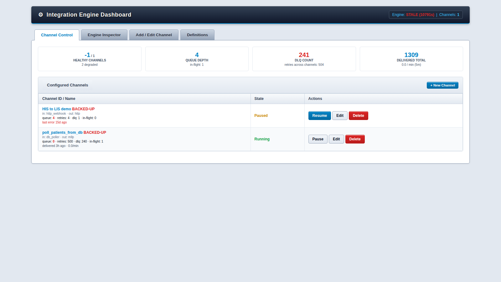

# INT-engine

Integration engine: JSON-configured channels (Ingestion → Enrichment → Transform → Destination), a Flask + HTMX admin dashboard, and a background worker daemon. Sync/thread-based throughout (no asyncio) — SQLite-backed queue, atomic multi-worker-safe dequeue, one or more worker threads per channel.

## Setup

```bash
pip install -r requirements.txt   # flask, requests
cp config/auth_profiles.json.example config/auth_profiles.json  # already done; edit with real secrets
```

`config/auth_profiles.json` is git-ignored. Channels reference a profile by `auth_profile_id` — the actual API keys/tokens never live in the channel config, only in this file.

## Running

Two processes:

```bash
python api/app.py       # dashboard + admin API + webhook receiver, port 5000
python -m engine.main   # background worker daemon: drains queues, runs pollers/MLLP server/file watcher
```

Open `http://localhost:5000` for the dashboard.

## Screenshots

The main control-plane dashboard — live channel health, queue metrics, and the configured-channels table, all re-rendered in place via HTMX:



## Architecture

- **Case 1 — Ingestion**:
  - `/api/ingest/<channel_id>` — manual/generic POST, always available regardless of a channel's configured protocol.
  - `nodes/ingestion/http_poller.py` — pull, runs in the worker daemon.
  - `nodes/ingestion/http_webhook.py` — push, registered onto the Flask app, optional HMAC signature verification.
  - `nodes/ingestion/mllp_server.py` — raw MLLP/TCP listener for HL7. Enqueues before ACKing (so a crash between the two never loses a message the sender believes was delivered), NACKs (AE) instead of accepting new messages once a channel's queue depth crosses its configured limit.
  - `nodes/ingestion/file_watcher.py` — polls a directory for `.csv`/`.hl7`/`.txt` files, claims each via an atomic rename to `.processing` before reading (so a crash mid-read doesn't silently drop or double-process it), moves finished files to `processed/` or `failed/`.
  - `nodes/ingestion/db_poller.py` — polls a database (SQLite/PostgreSQL/MySQL via SQLAlchemy) on an interval and enqueues each row. Supports cursor-based incremental pulls via `cursor_field`/`cursor_param`.
- **Case 2 — Enrichment**: `nodes/enrichment/batch_lookup.py`. Optional per channel — configure `enrichment_config` in the channel editor and reference results in mapping rules as `lookups.<lookup_name>.<field>`.
- **Case 3 — Transform**: `nodes/transform/field_mapper.py` + `nodes/transform/functions.py` (whitelisted functions only: Uppercase, Lowercase, Trim Whitespace, Format, Default — no eval, no dynamic scripting).
- **Case 4 — Destination**: `nodes/destination/http_client.py` (auth-aware, retries once on 401 with a fresh token), `nodes/destination/mllp_client.py`, and `nodes/destination/sftp_client.py` (uploads each payload as a file via SFTP, supports password or private-key auth).
- **Auth**: `core/auth_manager.py` — api_key, basic, bearer_static, oauth2_client_credentials with cached/locked token refresh. Shared by ingestion pollers, webhooks (signature secret is separate), and destinations.
- **Control plane**: `api/app.py` (Flask + HTMX dashboard, admin API, `/health`, per-channel and per-entry DLQ requeue/discard, message audit-trail lookup by trace_id), `engine/main.py` (worker daemon, ingestion lifecycle, stale-claim reclaim loop), `engine/config_loader.py` (SQLite-backed channel config with live schema migration).

## Reliability features

- **Idempotency** — set an `idempotency_key_field` on any ingestion type (or it's derived from MSH-10 automatically for MLLP). Duplicate keys for the same channel are rejected at `enqueue()` via a `UNIQUE(channel_id, idempotency_key)` constraint — no separate check-then-insert race.
- **Backpressure** — set `max_queue_depth` on any ingestion type. HTTP poller skips its tick, webhook returns `503`, MLLP NACKs (`AE`), file watcher leaves files in place — all without dropping anything, so the source system's own retry logic picks it back up once the queue drains.
- **Persistent audit trail** — every `queued` / `processing_started` / `delivered` / `retry_scheduled` / `dead_lettered` / `duplicate_rejected` event is appended to `audit_log`, independent of the `queue` table's current-state-only row. Look up by trace_id from the dashboard ("Message Audit Trail Lookup") or `GET /api/audit/<trace_id>` — works for delivered and still-queued messages too, not just DLQ.
- **Multi-worker scaling** — set "Worker Threads" (`concurrency`) per channel. Safe because `PersistentQueue.dequeue_available()` atomically claims a row (via a single `UPDATE ... WHERE trace_id = (SELECT ...)` plus a per-call claim token to read back exactly the row it claimed) before handing it to a worker — verified under 8 concurrent threads racing the same queue with zero duplicate or dropped claims.
- **Crash recovery** — if a worker dies between claiming a message (`PROCESSING`) and finishing it, that message would otherwise be stuck forever since no other worker will re-claim a `PROCESSING` row. `engine/main.py` runs a background loop calling `reclaim_stale_processing()` every 30s to put anything claimed longer than 2 minutes back to `QUEUED`.

## Still not implemented

- Config hot-reload staging/replay before a changed channel definition goes live (edits currently take effect on the next 2s config-sync tick, with no dry-run against recent messages first).
- True multi-**process** horizontal scaling — `concurrency` currently spins up threads within one `engine/main.py` process. The queue is already safe for multiple OS processes against the same `queue.db` (SQLite WAL + the same atomic claim logic), so running a second `python -m engine.main` instance works today, but there's no supervisor/orchestration for it.
